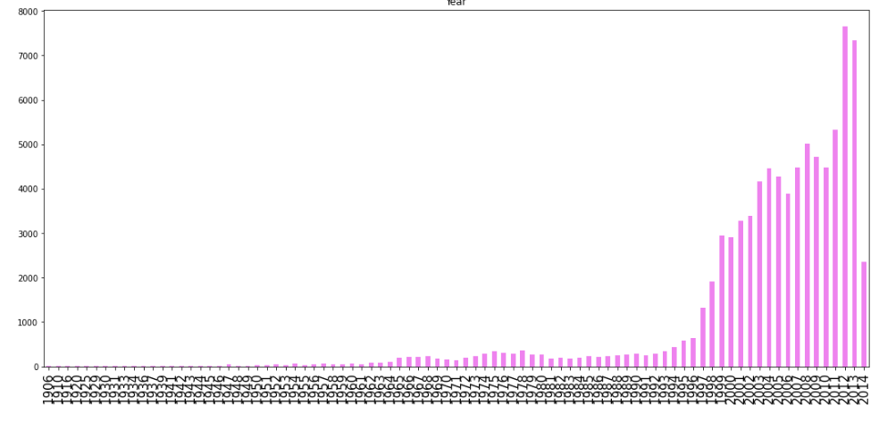
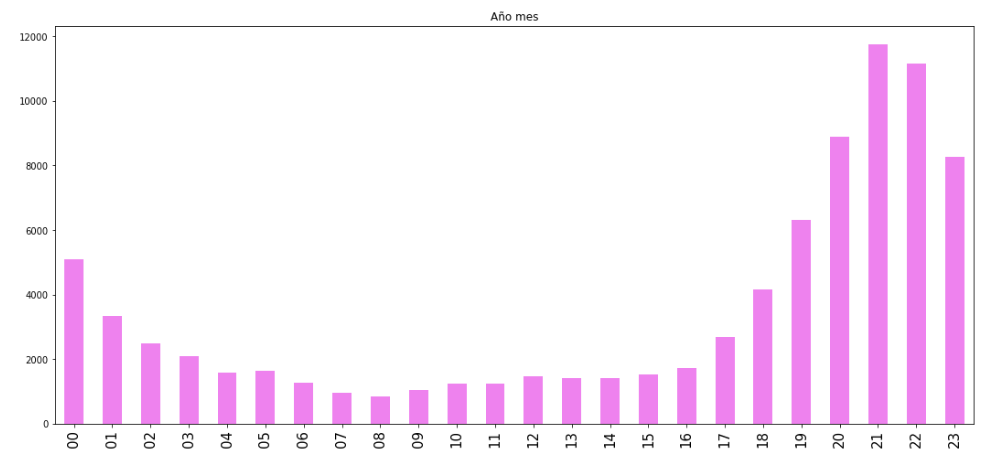
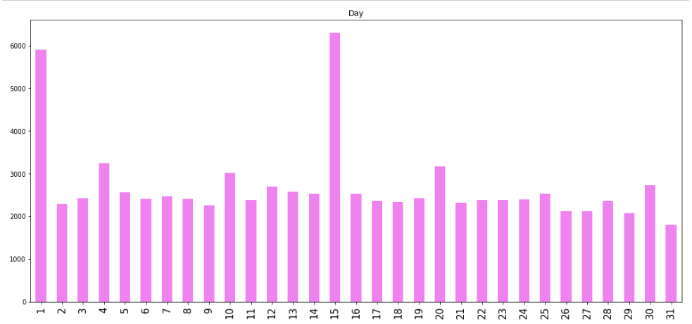

# Where will an UFO be?

Looking for UFO shapes in our reality is as much important as Science. Since 1995, UFO appareances occurances reported has been increasing, as the next figure shows. Almost of them are from US. Do you know that we have more than 20 types of ufo shapes which many of them are lights, triangules and circules. So, **what if we could predict when and where will appear some light in the next week?**

We don't certain know why does it happen, maybe availability of technology or ... are we close to the end of the world?

Even that, I see some insights that could give me an intuitive idea to construct predictions through Machine Learning, specially if we see what happend in the past, which hours were the most frequency of appearences? which day? where ? 

The hours with more appearences are from 19 to 24.

The days of the month with more appearences are the first and middle ones.

I also worked with descriptions, duration in seconds of the last occurances focusing all the treatment of the information to predict if in the next week we will see a light or a circle ... or maybe another ufo shape.

After all treatment, we have to see if our treatment of information was correct to achieve the challenge so we had to prove it on a Machine Learning algorithms and test some observations to know if we could generalize the treatment and have good results.

Note: The closer to 1, the better.

Attempt | #1 | #2 | #3 | #4 | #5 | #6 | #7 | #8 | #9 | #10 | #11
--- | --- | --- | --- |--- |--- |--- |--- |--- |--- |--- |---
Seconds | 301 | 283 | 290 | 286 | 289 | 285 | 287 | 287 | 272 | 276 | 269